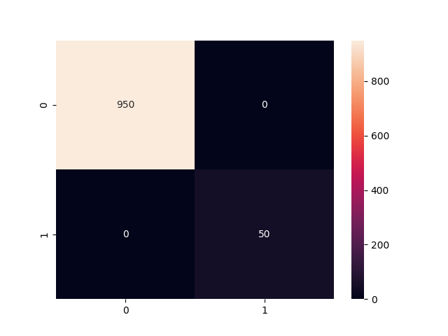

💳 Credit Card Fraud Detection System

🚀 Overview

This project is an end-to-end Machine Learning system that detects fraudulent credit card transactions using synthetic data and classification techniques.

It simulates real-world fraud detection pipelines used by banks and fintech companies.

---

🎯 Problem Statement

Credit card fraud causes significant financial losses. Detecting fraudulent transactions is challenging due to:

- Highly imbalanced data
- Evolving fraud patterns
- Need for real-time detection

---

💡 Solution

- Generated realistic synthetic transaction data
- Built a classification model using Random Forest
- Evaluated using precision, recall, and confusion matrix
- Visualized feature importance and fraud distribution

---

🧠 Tech Stack

- Python
- Pandas, NumPy
- Scikit-learn
- Matplotlib, Seaborn
- Joblib

---

📂 Project Structure

Credit-Card-Fraud-Detection/
│
├── data/
├── src/
├── models/
├── images/
├── main.py
├── generate_data.py
├── requirements.txt
└── README.md

---

⚙️ How to Run

1. Clone the repository

git clone https://github.com/palsreya785-ops/Credit-Card-Fraud-Detection-System.git
cd Credit-Card-Fraud-Detection-System

2. Install dependencies

pip install -r requirements.txt

3. Generate dataset

python generate_data.py

4. Run the project

python main.py

---

📊 Results

- Achieved high fraud detection performance
- Balanced precision and recall
- Generated confusion matrix and feature importance

---

📸 Outputs

🔹 Confusion Matrix

---

🔮 Future Improvements

- Add XGBoost for better performance
- Deploy using FastAPI
- Build real-time dashboard
- Handle real-world datasets

---

👨‍💻 Author

Sreya Pal

---

⭐ If you like this project, give it a star!
